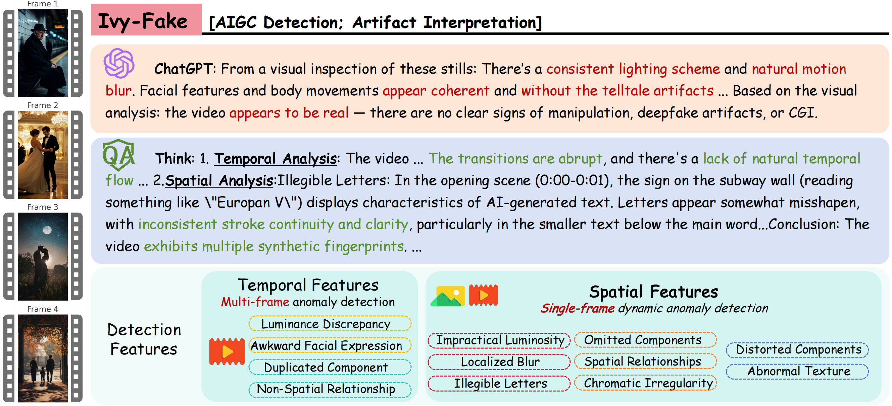

# IVY-FAKE: Unified Explainable Benchmark and Detector for AIGC Content



This repository provides the official implementation of **IVY-FAKE** and **IVY-xDETECTOR**, a unified explainable framework and benchmark for detecting AI-generated content (AIGC) across **both images and videos**.

Due to the double-blind requirement, we will release the dataset and related information after the conference concludes.

---

## 🔍 Overview

**IVY-FAKE** is the **first large-scale dataset** designed for **multimodal explainable AIGC detection**. It contains:
- **110K+** training samples (images + videos)
- **5K** evaluation samples
- **Fine-grained annotations** including:
  - Spatial and temporal artifact analysis
  - Natural language reasoning (<think>...</think>)
  - Binary labels with explanations (<conclusion>real/fake</conclusion>)

**IVY-xDETECTOR** is a vision-language detection model trained to:
- Identify synthetic artifacts in images and videos
- Generate **step-by-step reasoning**
- Achieve **Superior performance** across multiple benchmarks

---

## 📦 Evaluation

```bash
conda create -n ivy-detect python=3.10
conda activate ivy-detect

# Install dependencies
pip install -r requirements.txt
```

---

🚀 Evaluation Script

We provide an evaluation script to test large language model (LLM) performance on reasoning-based AIGC detection.

🔑 Environment Variables

Before running, export the following environment variables:

```bash
export OPENAI_API_KEY="your-api-key"
export OPENAI_BASE_URL="https://api.openai.com/v1"  # or OpenAI's default base URL
```

▶️ Run Evaluation

```bash
python eva_scripts.py \
  --eva_model_name gpt-4o-mini \
  --res_json_path ./error_item.json
```

This script compares model predictions (<conclusion>real/fake</conclusion>) to the ground truth and logs mismatches to error_item.json.

Step2: Print Result

```bash
python eva_step2_print_result.py \
  --input_file ./MiniCPM-V-4_5_eva.jsonl \
  --batch_size 16 \
  --bert_model ./deberta-xlarge-mnli
```

---

🧪 Input Format

The evaluation script `res_json_path` accepts a JSON array (Dict in List) where each item has:
```json
{
  "rel_path": "relative/path/to/file.mp4",
  "label": "real or fake",
  "raw_ground_truth": "<think>...</think><conclusion>fake</conclusion>",
  "infer_result": "<think>...</think><conclusion>real</conclusion>"
}
```

- label: ground truth
- raw_ground_truth: reasoning by gemini2.5 pro
- infer_result: model reasoning and prediction

Example file: `./evaluate_scripts/error_item.json`

---
